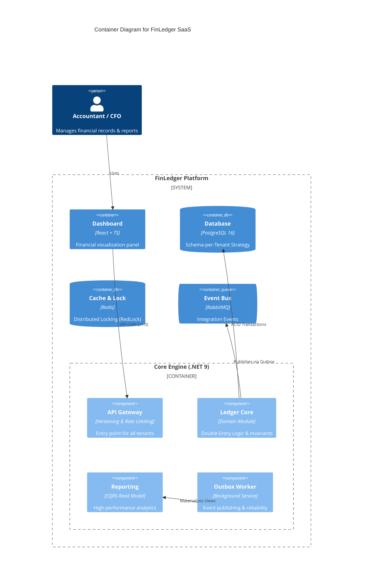

# 🏦 FinLedger SaaS
**Cloud-Native Double-Entry Accounting Engine**

> A high-performance, audit-ready financial ledger system designed for multi-tenant SaaS platforms. Built with **.NET 9**, **PostgreSQL 16**, and **Domain-Driven Design (DDD)**.


## 🎯 Problem Statement
Most modern SaaS applications handle financial data using "Anemic Domain Models", leading to **Data Integrity** issues. In high-stakes FinTech, systems often fail to enforce double-entry invariants or ensure strict tenant isolation. **FinLedger** bridges this gap by combining deep **Accounting Domain expertise** with **Robust Engineering patterns** to provide an immutable, compliant, and highly scalable financial engine.

---

## 🏗️ Architectural Overview (C4 Model)
FinLedger follows a **Modular Monolith** architecture to ensure strict domain boundaries while maintaining deployment simplicity and high consistency.

### System Context & Container Diagram


> **Strategic Note:** We chose a Modular Monolith over Microservices to maintain **Transactional Integrity** and reduce operational complexity while remaining "Microservices-ready". 
> **[Read more about our Strategic Decisions (ARCHITECTURE.md)](./ARCHITECTURE.md)**

---


## 🚀 Core Features & Technical Excellence

### 🏦 Advanced Financial Engine
- **Immutable Ledger (Zero-Delete Policy):** Implements a high-integrity accounting system where journal entries are finalized (Posted) and cannot be modified or deleted. All corrections are handled through **Automated Reversal Logic**, ensuring a 100% reliable audit trail.
- **Double-Entry Integrity:** The domain layer strictly enforces the fundamental accounting equation (`Sum(Debit) == Sum(Credit)`) as a system invariant, preventing out-of-balance transactions at the core level.

### 🏗️ Enterprise Architecture Patterns
- **CQRS with MediatR:** Clear separation of read and write concerns. Write operations use EF Core for complex business logic, while Read operations use **Dapper** for sub-second reporting performance.
- **Outbox Pattern:** Guarantees transactional consistency. Financial events are captured within the same atomic transaction as the business data, ensuring **Exactly-once processing** and preventing data loss during network failures.
- **High-Performance Engineering:** All Command/Query handlers are implemented as **Sealed Classes** to leverage .NET JIT devirtualization optimizations, reducing overhead in high-throughput financial pipelines.

### 🔐 Infrastructure & Resilience
- **Automated Multi-Tenancy:** Uses a sophisticated **Schema-per-Tenant** isolation strategy. The system dynamically creates and migrates database schemas for new tenants on-the-fly, ensuring maximum data privacy and regulatory compliance (GDPR/SOC2).
- **Distributed Locking (RedLock):** Leverages Redis to prevent race conditions during concurrent financial operations, ensuring deterministic states in a horizontally scaled environment.
- **SQL Security & Integrity:** Implements sanitized dynamic SQL execution using **Interpolated Strings** to prevent SQL Injection while maintaining the flexibility of schema-per-tenant isolation.
- **Observability:** 
    - **Structured Logging:** Powered by **Serilog** with JSON formatting for cloud-native log analysis.
    - **Health Monitoring:** Integrated ASP.NET Core Health Checks for PostgreSQL and Redis connectivity.

### 📊 Financial Reporting & Insights
- **Professional PDF Export:** Integrated **QuestPDF** engine to generate audit-ready Trial Balance reports with enterprise-grade layouts and automatic pagination.
- **Demo Data Seeding:** Built-in automated seeding engine to generate complex, balanced financial scenarios for instant testing and demonstration.

### 🛡️ Automated Quality Assurance
FinLedger is guarded by a triple-layer testing suite to ensure financial accuracy and architectural purity:
- **Domain Invariant Protection:** Rigorous testing of the `JournalEntry` aggregate root to prevent unbalanced transactions or illegal state transitions.
- **Architectural Guardrails:** Automated tests that verify modular boundaries, ensuring that the Domain layer remains pure and no prohibited dependencies (e.g., Infrastructure -> Domain) are introduced during development.
- **Integration Testing (TestContainers):** Uses ephemeral **PostgreSQL 16** containers in Docker to verify physical schema isolation and transactional integrity in a real-world environment.
- **Application Logic Verification:** Mocking external concerns with **NSubstitute** to verify command handlers, concurrency locks, and reliable messaging (Outbox).


### 🔐 Identity & Multi-tenant Security 
- **Modular Identity Architecture:** A fully decoupled Identity module designed following Modular Monolith principles, ensuring high cohesion and enabling future microservices extraction.
- **SaaS-Aware JWT Security:** Implements a custom JWT provider that embeds tenant-specific roles and claims into security tokens, allowing for sub-millisecond authorization without redundant database roundtrips.
- **Policy-Based RBAC:** Fine-grained access control using custom `IAuthorizationRequirement` and `AuthorizationHandler`. The system dynamically verifies if a user has the appropriate role (Admin, Accountant, Auditor) within the specific context of the requested Tenant ID.
- **Secure-by-Design Persistence:** Enforces industry-standard **BCrypt** hashing for password security and maintains a dedicated shared schema for global identity to allow seamless cross-tenant authentication.


---

## 🕹️ End-to-End Scenario: The Life of a Transaction
To see the system's robustness, consider this flow:
1. **Request:** A Tenant initiates a transfer via the Versioned API.
2. **Concurrency:** A **Redis Lock** is acquired to ensure serialized access to specific accounts.
3. **Validation:** The **MediatR Pipeline** triggers **FluentValidation** followed by Domain-level invariant checks.
4. **Persistence:** The Ledger record and an **Outbox Message** are saved in a single **ACID Transaction**.
5. **Reliability:** The **Background Worker** ensures the event is published even if the primary API process crashes.
6. **Insight:** The **Reporting Engine** extracts data from the isolated schema to produce a professional PDF report.

---

## 🗺️ Project Roadmap

- [x] **Phase 1-4:** Core Engine, Multi-tenant Isolation, Outbox Pattern, Redis Distributed Locking, and Professional PDF Reporting.
- [x] **Phase 5: Automated Quality Assurance**
    - [x] **Unit Testing:** 100% coverage of core accounting invariants using **xUnit** and **FluentAssertions**.
    - [x] **Architecture Testing:** Automated enforcement of Clean Architecture (Onion) boundaries using **NetArchTest**.
    - [x] **Integration Testing:** Real-world verification of Schema-per-tenant logic using **TestContainers** (PostgreSQL 16 in Docker).
- [x] **Phase 6: Advanced Identity & RBAC **
    - [x] **Modular Identity:** Decoupled Identity module following Modular Monolith principles.
    - [x] **Multi-tenant JWT:** Custom security tokens carrying tenant-specific roles and claims.
    - [x] **Dynamic RBAC:** Policy-based authorization with custom handlers to enforce cross-tenant data boundaries.
    - [x] **Secure Persistence:** BCrypt password hashing and dedicated global identity schema.
- [ ] **Phase 7: Cloud-Native Observability**
    - Distributed Tracing with **OpenTelemetry**, Jaeger, and Advanced Health Monitoring.
---


## 🕹️ Getting Started: The Developer Journey

Follow these steps to explore the system's full multi-tenant security and financial integrity flow.

### 🛠️ 1. Prerequisites & Infrastructure
Ensure you have **Docker Desktop** and **.NET 9 SDK** installed.
```powershell
# Start PostgreSQL, Redis, and RabbitMQ
docker-compose up -d
```

### 🚀 2. Run the Application
Execute the Host API project:
```powershell
dotnet run --project src/Modules/Ledger/FinLedger.Modules.Ledger.Api/FinLedger.Modules.Ledger.Api.csproj
```
> **Swagger UI:** [http://localhost:5000/swagger](http://localhost:5000/swagger)

---

### 🛡️ 3. The End-to-End Testing Flow (Step-by-Step)

To verify the **Multi-tenant RBAC** and **Ledger Isolation**, follow this sequence in Swagger:

| Step | Action | Endpoint | Key Note |
| :--- | :--- | :--- | :--- |
| **1** | **Register** | `POST /identity/Users/register` | Creates a global user identity. |
| **2** | **Assign Role** | `POST /identity/Users/assign-role` | Connects user to a `tenant_id` (e.g., `berlin_hq`) with a role (1=Admin). |
| **3** | **Login** | `POST /identity/Users/login` | Returns a **JWT Token** containing tenant-specific claims. |
| **4** | **Authorize** | Click **Authorize** button | Paste the token (Swagger automatically adds the 'Bearer' prefix). |
| **5** | **Ledger Action**| `POST /ledger/Entries` | Set Header `X-Tenant-Id: berlin_hq`. System verifies role inside the token for this specific tenant. |

---

### 🧪 4. Running the Test Suite
FinLedger uses a triple-layer testing strategy. You can run all tests via CLI:
```powershell
# Runs Unit, Architecture, and Integration Tests (TestContainers)
dotnet test
```
- **Integration Tests:** Automatically spin up ephemeral Docker containers for a clean-room verification of the database logic.
- **Architecture Tests:** Enforce Clean Architecture boundaries and naming conventions automatically.


---


## 🛠️ Tech Stack

- **Framework:** .NET 9 (C# 13), MediatR, FluentValidation, Serilog.
- **Security & Identity:** JWT Bearer Authentication, Custom Policy-based RBAC, BCrypt.Net (Password Hashing).
- **Testing Suite:** xUnit, FluentAssertions, NetArchTest, NSubstitute, **TestContainers (PostgreSQL & Redis)**.
- **Data Persistence:** PostgreSQL 16 (Schema-per-Tenant), EF Core 9, Dapper (High-perf Read Model), Redis (Distributed Locking).
- **Infrastructure & Tools:** Docker Compose, QuestPDF (Professional Reporting), ASP.NET Core Health Checks.

---
**Status:**  *Production-Grade Ledger Engine Operational.*
```

---
