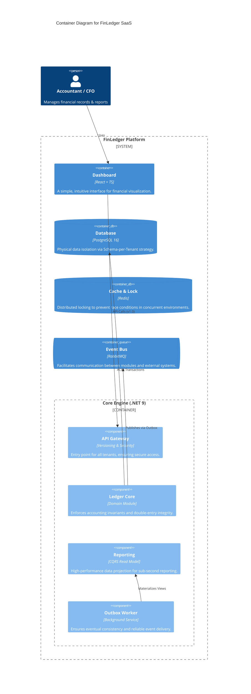
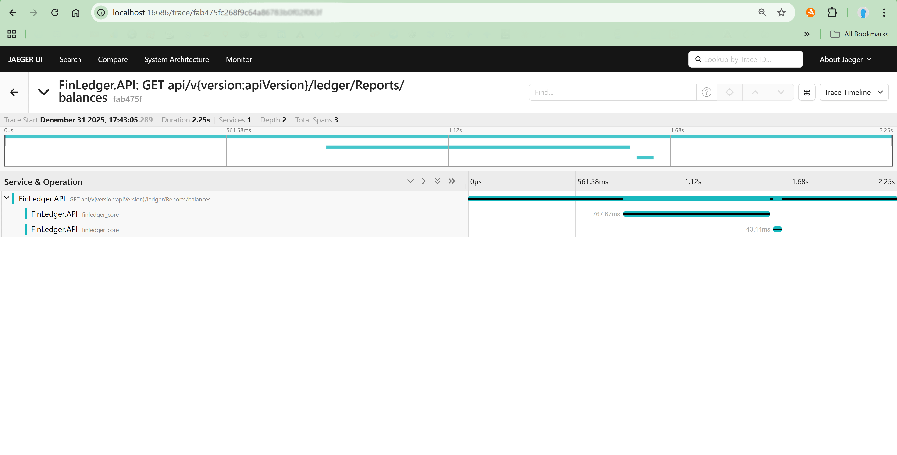
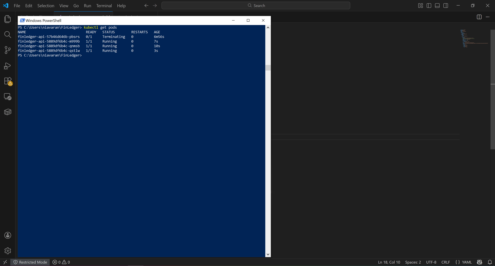

# 🏦 FinLedger SaaS
**Cloud-Native Double-Entry Accounting Engine**

> A high-performance, audit-ready financial ledger system designed for multi-tenant SaaS platforms. Built with **.NET 9**, **PostgreSQL 16**, and **Domain-Driven Design (DDD)**.

[](https://github.com/amirhosein2015/FinLedger/actions/workflows/ci-pipeline.yml)


## 🎯 Problem Statement
Most modern SaaS applications handle financial data using "Anemic Domain Models", leading to **Data Integrity** issues. In high-stakes FinTech, systems often fail to enforce double-entry invariants or ensure strict tenant isolation. **FinLedger** bridges this gap by combining deep **Accounting Domain expertise** with **Robust Engineering patterns** to provide an immutable, compliant, and highly scalable financial engine.

---

### 🏗️ Architectural Overview (C4 Model)

In designing **FinLedger**, my primary goal wasn't to build the most complex system possible, but rather the most **reliable** one. I believe that architecture is a set of conscious trade-offs, and for a financial system, data integrity must always come first.

I opted for a **Modular Monolith** approach. While Microservices are powerful, I felt that at this stage, a Modular Monolith offered the best balance: it provides strict domain boundaries and a clear path to future scalability, while keeping the system easy to reason about, test, and deploy.

#### 📊 System Context & Container Diagram
The following C4 diagram is a humble attempt to visualize how different components of the ecosystem—from the React dashboard to the PostgreSQL storage—interact to ensure a seamless experience for both tenants and auditors.



> **🌿 A Pragmatic Choice:** I chose a Modular Monolith over Microservices to prioritize **Transactional Integrity** and reduce operational overhead during the initial growth phases. However, by enforcing strict boundaries through DDD, the system remains "Microservices-ready" should the business need to scale specific modules independently in the future.

> **📖 Want to dive deeper?** I’ve documented the "Why" behind every major technical decision in our [**ARCHITECTURE.md**](./ARCHITECTURE.md) file. I’m always happy to discuss these trade-offs and learn from different perspectives.


---


## 🚀 Core Features & Design Philosophy

### 🏦 Advanced Financial Engine
- **Immutable Ledger (Zero-Delete Policy):** Implements a high-integrity accounting system where journal entries are finalized (Posted) and cannot be modified or deleted. All corrections are handled through **Automated Reversal Logic**, ensuring a 100% reliable audit trail.
- **Double-Entry Integrity:** The domain layer strictly enforces the fundamental accounting equation (`Sum(Debit) == Sum(Credit)`) as a system invariant, preventing out-of-balance transactions at the core level.

### 🏗️ Enterprise Architecture Patterns
- **CQRS with MediatR:** Clear separation of read and write concerns. Write operations use EF Core for complex business logic, while Read operations use **Dapper** for sub-second reporting performance.
- **Outbox Pattern:** Guarantees transactional consistency. Financial events are captured within the same atomic transaction as the business data, ensuring **Exactly-once processing** and preventing data loss during network failures.
- **High-Performance Engineering:** All Command/Query handlers are implemented as **Sealed Classes** to leverage .NET JIT devirtualization optimizations, reducing overhead in high-throughput financial pipelines.

### 🔐 Infrastructure & Resilience
- **Automated Multi-Tenancy:** Uses a sophisticated **Schema-per-Tenant** isolation strategy. The system dynamically creates and migrates database schemas for new tenants on-the-fly, ensuring maximum data privacy and regulatory compliance (GDPR/SOC2).
- **Distributed Locking (RedLock):** Leverages Redis to prevent race conditions during concurrent financial operations, ensuring deterministic states in a horizontally scaled environment.
- **SQL Security & Integrity:** Implements sanitized dynamic SQL execution using **Interpolated Strings** to prevent SQL Injection while maintaining the flexibility of schema-per-tenant isolation.
- **Observability:** 
    - **Structured Logging:** Powered by **Serilog** with JSON formatting for cloud-native log analysis.
    - **Health Monitoring:** Integrated ASP.NET Core Health Checks for PostgreSQL and Redis connectivity.

### 📊 Financial Reporting & Insights
- **Professional PDF Export:** Integrated **QuestPDF** engine to generate audit-ready Trial Balance reports with enterprise-grade layouts and automatic pagination.
- **Demo Data Seeding:** Built-in automated seeding engine to generate complex, balanced financial scenarios for instant testing and demonstration.

### 🛡️ Automated Quality Assurance
FinLedger is guarded by a triple-layer testing suite to ensure financial accuracy and architectural purity:
- **Domain Invariant Protection:** Rigorous testing of the `JournalEntry` aggregate root to prevent unbalanced transactions or illegal state transitions.
- **Architectural Guardrails:** Automated tests that verify modular boundaries, ensuring that the Domain layer remains pure and no prohibited dependencies (e.g., Infrastructure -> Domain) are introduced during development.
- **Integration Testing (TestContainers):** Uses ephemeral **PostgreSQL 16** containers in Docker to verify physical schema isolation and transactional integrity in a real-world environment.
- **Application Logic Verification:** Mocking external concerns with **NSubstitute** to verify command handlers, concurrency locks, and reliable messaging (Outbox).


### 🔐 Identity & Multi-tenant Security 
- **Modular Identity Architecture:** A fully decoupled Identity module designed following Modular Monolith principles, ensuring high cohesion and enabling future microservices extraction.
- **SaaS-Aware JWT Security:** Implements a custom JWT provider that embeds tenant-specific roles and claims into security tokens, allowing for sub-millisecond authorization without redundant database roundtrips.
- **Policy-Based RBAC:** Fine-grained access control using custom `IAuthorizationRequirement` and `AuthorizationHandler`. The system dynamically verifies if a user has the appropriate role (Admin, Accountant, Auditor) within the specific context of the requested Tenant ID.
- **Secure-by-Design Persistence:** Enforces industry-standard **BCrypt** hashing for password security and maintains a dedicated shared schema for global identity to allow seamless cross-tenant authentication.


### 🕵️ Cloud-Native Observability 
- **Distributed Tracing:** Implements full request lifecycle tracking using **OpenTelemetry (OTEL)**. Every request is traced as it travels from the API through MediatR pipelines and down to the database.
- **Performance Diagnostics:** Integrated with **Jaeger** to visualize execution spans, allowing for instant identification of slow SQL queries or distributed lock contentions.
- **Deep Instrumentation:** Automatic monitoring of **PostgreSQL** execution and **Redis** commands, providing a "glass-box" view of system behavior without manual code pollution.

#### 📊 Distributed Tracing in Action (Live Demo)
The following trace demonstrates the full request lifecycle. It captures the correlation between the incoming API call, the MediatR pipeline execution, and the final optimized SQL query execution within the specific tenant's schema.



> ** This level of observability ensures that we can identify performance bottlenecks at the database layer and verify that our **Schema-per-Tenant** isolation is working correctly in real-time.

**Strategic Technical Signals:**
- **Zero-Guesswork Performance:** Every span provides sub-millisecond precision on execution time across the API, MediatR pipelines, and PostgreSQL layers.
- **Tenant Isolation Proof:** The trace confirms that the SQL instrumentation correctly executes within the dynamically resolved tenant schema (e.g., `berlin_hq`), validating physical data isolation.
- **Maintenance Scalability:** By using **OpenTelemetry**, the system is "Cloud-Agnostic" and ready for enterprise monitoring tools like Prometheus, Elastic, or New Relic without changing a single line of business logic.


### 🛡️ Financial Compliance & Immutable Audit Trails 
FinLedger ensures 100% accountability through an automated auditing engine:
- **Zero-Touch Auditing:** Leveraging EF Core Change Tracking to intercept and log every database modification (Insert/Update/Delete) without manual intervention in business handlers.
- **Correlated Identity:** Every audit entry automatically captures the Global User ID from the JWT context via a decoupled `ICurrentUserProvider`.
- **Forensic Transparency:** Entity states are serialized into high-performance **PostgreSQL JSONB** columns, providing a complete "Before/After" history for regulatory compliance.
- **Physical Data Isolation:** Audit logs are stored within each tenant's private schema, satisfying strict **GDPR and SOC2** data residency requirements.

### 🤖 Enterprise CI/CD Pipeline
FinLedger is production-ready with a fully automated delivery pipeline:
- **Continuous Integration:** Every commit is automatically verified via **GitHub Actions** on a Linux environment.
- **Infrastructure-as-Code Testing:** Integration tests utilize **TestContainers** to dynamically spin up PostgreSQL and Redis within the CI runner, ensuring zero environmental drift.
- **Quality Gates:** Enforces strict build and test success criteria before allowing code merges, maintaining the integrity of the Modular Monolith.


## 🚢 Production & Cloud-Native Deployment

FinLedger is designed for the modern cloud, ensuring high availability and operational excellence:

### 🐳 Container Optimization
Uses a **Multi-stage Dockerfile** to minimize the attack surface and image size (~80MB). The runtime environment is based on **.NET 9 Alpine**, following security best practices by running as a **Non-Root user**.

### ☸️ Kubernetes Orchestration
The system is ready for **Enterprise Clusters** (AKS, EKS, GKE) with production-grade manifests:
- **Scalability:** Configured with 3-replica deployments for zero-downtime updates.
- **Resilience:** Implements **Liveness & Readiness Probes** connected to the system's Health Checks.
- **Resource Management:** Explicit CPU/Memory limits and requests to ensure predictable cloud costs and prevent resource contention.
- **Secret Management:** Decoupled sensitive data (JWT keys, Connection Strings) using K8s **Secrets** and **ConfigMaps**.

### 🖥️ Modular Frontend Showcase (Phase 11 - In Progress 🚧)
To demonstrate the full potential of the FinLedger API, I am developing a dedicated frontend that serves as an **Architectural Dashboard**. This isn't just a UI; it's a verification tool designed with the same modular discipline as the backend.

- **Domain-Driven Frontend:** The React structure mirrors the Backend Modular Monolith, ensuring a consistent ubiquitous language across the entire stack.
- **Type-Safe Integration:** Leverages **TypeScript** and **Zod** to enforce strict data contracts between the API and the UI.
- **Efficient State Management:** Utilizes **TanStack Query** for resilient data fetching, caching, and synchronization with the multi-tenant engine.
- **Minimalist Design:** Built with a "Low-Noise" philosophy to ensure the focus remains on the system's operational integrity and audit transparency.

---

### 🕹️ End-to-End Scenario: The Life of a Transaction

To illustrate how these layers work together in harmony to ensure financial integrity and cloud-native reliability, here is the journey of a single audited transaction:

| Step | Layer | Action |
| :--- | :--- | :--- |
| **1** | **DevOps (CI)** | **GitHub Actions** automatically triggers a build and executes the triple-layer test suite (Unit, Architecture, and Integration) to verify code integrity before any deployment. |
| **2** | **Orchestration** | **Kubernetes** hosts the engine in a self-healing, 3-replica cluster, managing resource limits and health probes to ensure high availability. |
| **3** | **API Gateway** | A Tenant initiates a request via the Versioned API, where the system dynamically resolves the **Tenant Identity** from the request context. |
| **4** | **Resilience** | A **Redis RedLock** is acquired to ensure serialized, thread-safe access to the financial accounts, preventing race conditions in a distributed environment. |
| **5** | **Validation** | The **MediatR Pipeline** executes **FluentValidation** followed by rich Domain-level invariant checks to ensure the double-entry balance is never violated. |
| **6** | **Persistence** | The Ledger record and an **Outbox Message** are saved in a single **ACID Transaction**, guaranteeing that business data and integration events remain consistent. |
| **7** | **Compliance** | Simultaneously, the system automatically captures the "Before/After" state and the User ID in an **Immutable Audit Log** for forensic accountability. |
| **8** | **Reliability** | The **Background Worker** processes the Outbox messages, ensuring that integration events are delivered to the message broker even if the primary process fails. |
| **9** | **Insight** | The **Reporting Engine (Dapper)** extracts data from the isolated schema to produce sub-second JSON responses or professional **QuestPDF** documents. |
| **10** | **Observability** | Every single step above is correlated as a unified **Trace in Jaeger**, providing 100% transparency into the performance and behavior of the transaction. |

---

## 🗺️ Project Evolution & Completed Milestones

FinLedger has evolved through a structured engineering roadmap, moving from a core financial engine to a fully orchestrated cloud-native ecosystem.

- [x] **Phase 1-4: Core Financial Engine**
    - Multi-tenant physical isolation, Double-entry integrity, and Outbox reliability.
- [x] **Phase 5: Automated Quality Assurance**
    - Triple-layer testing suite using **TestContainers** for real-world environment parity.
- [x] **Phase 6: Advanced Identity & RBAC**
    - Multi-tenant JWT security with custom claims and policy-based authorization.
- [x] **Phase 7: Cloud-Native Observability**
    - Full request tracing with **OpenTelemetry** and **Jaeger** visualization.
- [x] **Phase 8: Financial Compliance & Auditing**
    - Zero-touch automated audit logs for 100% database change accountability.
- [x] **Phase 9: Continuous Integration (CI)**
    - Automated **GitHub Actions** pipeline for cloud-based verification.
- [x] **Phase 10: Production Hardening & Orchestration**
    - Optimized Docker builds and **Kubernetes** manifests for high-availability.
- [ ] **Phase 11: The Interactive Showcase (Current Goal 🎨)**
    - [ ] Developing a **Modular React + TypeScript** dashboard to visually demonstrate multi-tenancy, real-time auditing, and financial reporting.


---

### 🚀 The Road Ahead (Future Enhancements)
- **Phase 12:** Integration of **Event Sourcing** for immutable ledger history.
- **Phase 13:** AI-driven anomaly detection using the recorded Audit Log patterns.


---

## 🕹️ Getting Started: The Developer Journey

Follow these steps to explore the system's full multi-tenant security, financial integrity, and cloud-native orchestration.

### 🛠️ 1. Prerequisites & Infrastructure
Ensure you have **Docker Desktop** (with Kubernetes enabled), **kubectl**, and **.NET 9 SDK** installed.
```powershell
# Start PostgreSQL, Redis, RabbitMQ, and Jaeger (Monitoring)
docker-compose up -d
```

### 🚀 2. Run the Application
You can run the engine either as a standalone process or within the Kubernetes cluster.

**Option A: Local Development Mode**
```powershell
$env:ASPNETCORE_ENVIRONMENT="Development"
dotnet run --project src/Modules/Ledger/FinLedger.Modules.Ledger.Api/FinLedger.Modules.Ledger.Api.csproj
```

**Option B: Kubernetes Verification (Phase 10)**
```powershell
# Apply the production-grade manifests
kubectl apply -f deploy/k8s/

# Verify the 3-replica High Availability state
kubectl get pods
```

> **Endpoints:**
> - **Swagger UI:** [http://localhost:5000/swagger](http://localhost:5000/swagger)
> - **Jaeger Tracing:** [http://localhost:16686](http://localhost:16686)

---

### 🛡️ 3. The End-to-End Testing Flow (Step-by-Step)

To verify the full lifecycle of a secure, audited transaction, follow this sequence in Swagger:

| Step | Action | Endpoint | Key Note |
| :--- | :--- | :--- | :--- |
| **1** | **Register** | `POST /identity/Users/register` | Creates your global platform identity. |
| **2** | **Assign Role**| `POST /identity/Users/assign-role` | Connects you to a `tenant_id` (e.g., `v8_test`) as **Admin (1)**. |
| **3** | **Login** | `POST /identity/Users/login` | Obtain a **JWT Token** containing tenant-specific claims. |
| **4** | **Authorize** | Click **Authorize** button | Paste the token (System handles the Bearer prefix). |
| **5** | **Execute** | `POST /ledger/Accounts` | Set Header `X-Tenant-Id: v8_test`. Schema is auto-provisioned on call. |
| **6** | **Audit Check**| `GET /ledger/Reports/audit-logs` | See how the system automatically tracked your "Who, When, and What". |

---

### 🕵️ 4. Observability & Infrastructure
After performing the steps above, visit the **Jaeger Dashboard**. You can observe the correlated traces showing exactly how the MediatR pipeline interacted with the PostgreSQL specific tenant schema.

---

### 🧪 5. Running the Test Suite
FinLedger is guarded by a triple-layer testing strategy to ensure zero regression:
```powershell
# Runs Unit, Architecture, and Integration Tests (TestContainers)
dotnet test
```
- **Integration Tests:** Leverage **TestContainers** to spin up ephemeral PostgreSQL 16 instances, ensuring real-world database logic verification.
- **Architecture Tests:** Automatically enforce Clean Architecture boundaries and naming conventions.

---

## 🛠️ Tech Stack (The Principal Suite)

- **Framework:** .NET 9 (C# 13), MediatR (CQRS), FluentValidation.
- **Security & Identity:** **JWT Bearer Auth**, **Multi-tenant RBAC**, **BCrypt.Net**.
- **Orchestration & DevOps:** **Kubernetes (K8s)**, **GitHub Actions (CI)**, Docker Multi-stage Builds.
- **Observability:** **OpenTelemetry (OTEL)**, **Jaeger**, Serilog (JSON).
- **Persistence:** PostgreSQL 16 (**Schema-per-Tenant**), EF Core 9, **Dapper** (High-perf Reads).
- **Resilience:** Redis (**RedLock Distributed Locking algorithm**), Outbox Pattern.
- **Testing:** xUnit, FluentAssertions, NetArchTest, NSubstitute, **TestContainers**.

---

**Status:** 🏆 **Production-Grade, High-Availability Ledger Engine Fully Operational.**

> **Note to Reviewers:** This project has successfully passed the full lifecycle from Domain-Driven Design to Kubernetes Orchestration. The current configuration supports self-healing, horizontal scaling, and zero-downtime deployments.


```

---
