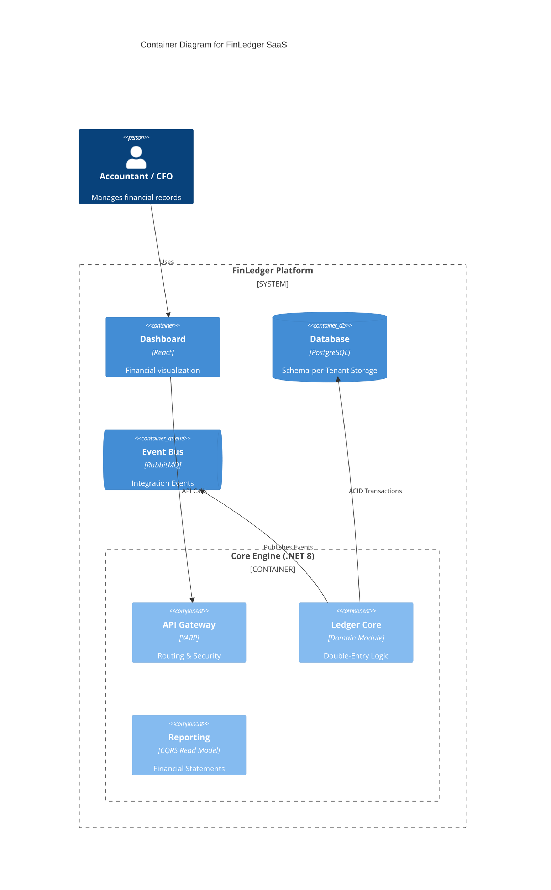

# 🏦 FinLedger SaaS
**Cloud-Native Double-Entry Accounting Engine**

> A high-performance, audit-ready financial ledger system designed for multi-tenant SaaS platforms. Built with **.NET 8**, **PostgreSQL**, and **Domain-Driven Design (DDD)** principles.

  

## 🏗️ Architectural Overview (C4 Model)
FinLedger follows a **Modular Monolith** architecture to ensure strict domain boundaries while maintaining deployment simplicity.

### System Context


## 🚀 Key Features (Principal Level)
- **Multi-Tenancy:** Schema-per-tenant isolation strategy ensuring 100% data privacy.
- **Double-Entry Integrity:** `Debit == Credit` invariant enforced at the Domain level.
- **Audit Trail:** Immutable ledger entries using Event Sourcing concepts.
- **Concurrency Control:** Optimistic locking to handle high-throughput financial transactions.

## 🛠️ Tech Stack
- **Core:** .NET 8, EF Core, MassTransit
- **Data:** PostgreSQL 16, Redis
- **DevOps:** Docker Compose, GitHub Actions

## 🚦 Getting Started
1. Clone the repository.
2. Run infrastructure:
   ```bash
   docker-compose up -d
   ```
3. Open the solution in Visual Studio / Rider.
