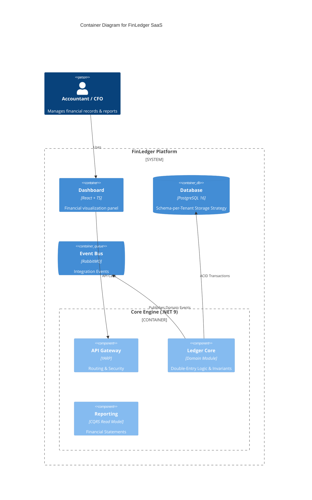

# 🏦 FinLedger SaaS
**Cloud-Native Double-Entry Accounting Engine**

> A high-performance, audit-ready financial ledger system designed for multi-tenant SaaS platforms. Built with **.NET 9**, **PostgreSQL 16**, and **Domain-Driven Design (DDD)** principles.

   

## 🏗️ Architectural Overview (C4 Model)
FinLedger follows a **Modular Monolith** architecture to ensure strict domain boundaries while maintaining deployment simplicity and high consistency.

### System Context


## 🚀 Key Features (Principal Level)
- **Multi-Tenancy:** Advanced **Schema-per-tenant** isolation strategy for enterprise-grade data privacy and compliance.
- **Double-Entry Integrity:** Strict `Debit == Credit` invariant enforced within the Domain Aggregate roots.
- **Audit-Ready:** Immutable ledger design ensures a reliable audit trail for all financial movements.
- **Modern Stack:** Fully leveraging **.NET 9** performance enhancements and **C# 13** features.
- **Concurrency Control:** Optimistic locking to handle high-throughput transactions without data corruption.

## 🗺️ Project Roadmap
- [x] **Phase 1: Foundation & Persistence**
    - [x] Modular Monolith & Solution Architecture.
    - [x] Multi-tenancy Core (Schema-per-tenant via EF Core).
    - [x] Domain Modeling (Account, JournalEntry).
    - [x] Initial API Integration & PostgreSQL Deployment.
- [ ] **Phase 2: Application Patterns (CQRS)**
    - [ ] Implementation of **MediatR** for Command/Query separation.
    - [ ] FluentValidation for complex business rules.
    - [ ] Dynamic Schema creation for new Tenant onboarding.
- [ ] **Phase 3: Resilience & Consistency**
    - [ ] **Outbox Pattern** for guaranteed event delivery.
    - [ ] **Redis** Distributed Locking for financial concurrency safety.
    - [ ] OpenTelemetry for distributed tracing & observability.
- [ ] **Phase 4: Financial Excellence & Reporting**
    - [ ] Fiscal Year closing logic & Period locking.
    - [ ] High-performance reporting using optimized SQL/Dapper.
    - [ ] Automated PDF statement generation via background workers.

## 🛠️ Tech Stack
- **Core:** .NET 9.0 (LTS Ready), C# 13
- **Persistence:** EF Core 9, PostgreSQL 16
- **Messaging:** MassTransit with RabbitMQ
- **Caching:** Redis (RedLock for Distributed Locking)
- **Observability:** OpenTelemetry & Serilog
- **DevOps:** Docker Compose, GitHub Actions (CI/CD)

## 🚦 Getting Started
1. Clone the repository.
2. Run infrastructure containers:
   ```bash
   docker-compose up -d
   ```
3. Open the solution in **Visual Studio 2022 (v17.12+)** or **JetBrains Rider**.
4. Run the API project and explore via Swagger at `http://localhost:5000/swagger`.

---
**Note:** This project is part of a professional portfolio focusing on **Financial Engineering** and **System Architecture**.

**Current Status:** 🟢 *Phase 1 Complete. First API transaction successful. Moving to CQRS implementation.*
```

---
