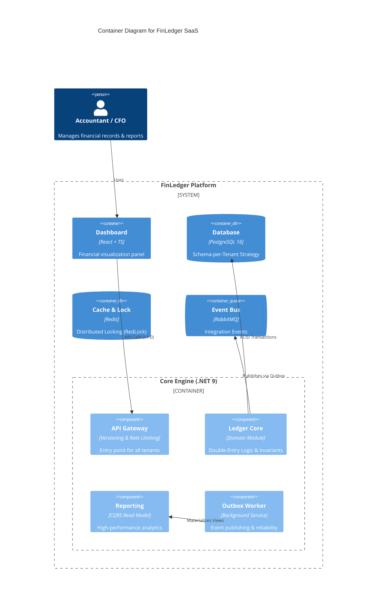

# 🏦 FinLedger SaaS
**Cloud-Native Double-Entry Accounting Engine**

> A high-performance, audit-ready financial ledger system designed for multi-tenant SaaS platforms. Built with **.NET 9**, **PostgreSQL 16**, and **Domain-Driven Design (DDD)**.

  

## 🎯 Problem Statement
Most modern SaaS applications handle financial data using "Anemic Domain Models", leading to **Data Integrity** issues. In high-stakes FinTech, systems often fail to enforce double-entry invariants or ensure strict tenant isolation. **FinLedger** bridges this gap by combining deep **Accounting Domain expertise** with **Robust Engineering patterns** to provide an immutable, compliant, and highly scalable financial engine.

---

## 🏗️ Architectural Overview (C4 Model)
FinLedger follows a **Modular Monolith** architecture to ensure strict domain boundaries while maintaining deployment simplicity and high consistency.

### System Context & Container Diagram


> **Strategic Note:** We chose a Modular Monolith over Microservices to maintain **Transactional Integrity** and reduce operational complexity while remaining "Microservices-ready". 
> **[Read more about our Strategic Decisions (ARCHITECTURE.md)](./ARCHITECTURE.md)**

---

## 🚀 Core Features & Technical Excellence

### 🏦 Advanced Financial Engine
- **Immutable Ledger (Zero-Delete Policy):** Implements a high-integrity accounting system where journal entries are finalized (Posted) and cannot be modified or deleted. All corrections are handled through **Automated Reversal Logic**, ensuring a 100% reliable audit trail.
- **Double-Entry Integrity:** The domain layer strictly enforces the fundamental accounting equation (`Sum(Debit) == Sum(Credit)`) as a system invariant, preventing out-of-balance transactions at the core level.

### 🏗️ Enterprise Architecture Patterns
- **CQRS with MediatR:** Clear separation of read and write concerns. Write operations use EF Core for complex business logic, while Read operations use **Dapper** for sub-second reporting performance.
- **Outbox Pattern:** Guarantees transactional consistency. Financial events are captured within the same atomic transaction as the business data, ensuring **Exactly-once processing** and preventing data loss during network failures.

### 🔐 Infrastructure & Resilience
- **Automated Multi-Tenancy:** Uses a sophisticated **Schema-per-Tenant** isolation strategy. The system dynamically creates and migrates database schemas for new tenants on-the-fly, ensuring maximum data privacy and regulatory compliance (GDPR/SOC2).
- **Distributed Locking (RedLock):** Leverages Redis to prevent race conditions during concurrent financial operations, ensuring deterministic states in a horizontally scaled environment.
- **Observability:** 
    - **Structured Logging:** Powered by **Serilog** with JSON formatting for cloud-native log analysis.
    - **Health Monitoring:** Integrated ASP.NET Core Health Checks for PostgreSQL and Redis connectivity.

### 📊 Financial Reporting & Insights
- **Professional PDF Export:** Integrated **QuestPDF** engine to generate audit-ready Trial Balance reports with enterprise-grade layouts and automatic pagination.
- **Demo Data Seeding:** Built-in automated seeding engine to generate complex, balanced financial scenarios for instant testing and demonstration.

---

## 🕹️ End-to-End Scenario: The Life of a Transaction
To see the system's robustness, consider this flow:
1. **Request:** A Tenant initiates a transfer via the Versioned API.
2. **Concurrency:** A **Redis Lock** is acquired to ensure serialized access to specific accounts.
3. **Validation:** The **MediatR Pipeline** triggers **FluentValidation** followed by Domain-level invariant checks.
4. **Persistence:** The Ledger record and an **Outbox Message** are saved in a single **ACID Transaction**.
5. **Reliability:** The **Background Worker** ensures the event is published even if the primary API process crashes.
6. **Insight:** The **Reporting Engine** extracts data from the isolated schema to produce a professional PDF report.

---

## 🗺️ Project Roadmap
- [x] **Phase 1-4:** Core Engine, Multi-tenancy, Outbox, Redis Locking, and PDF Reporting.
- [ ] **Phase 5: Automated Quality Assurance**
    - Unit Tests for invariants & Integration Tests with **TestContainers**.
- [ ] **Phase 6: Advanced Identity & RBAC**
    - Multi-tenant Role-Based Access Control (Admin, Accountant, Auditor).

## 🛠️ Tech Stack
- **Framework:** .NET 9 (C# 13), MediatR, FluentValidation, Serilog.
- **Data:** PostgreSQL 16 (Schema Isolation), EF Core 9, Dapper, Redis.
- **DevOps:** Docker Compose, QuestPDF, Health Checks.

---
**Status:** 🏆 *Production-Grade Ledger Engine Operational.*
```

---
