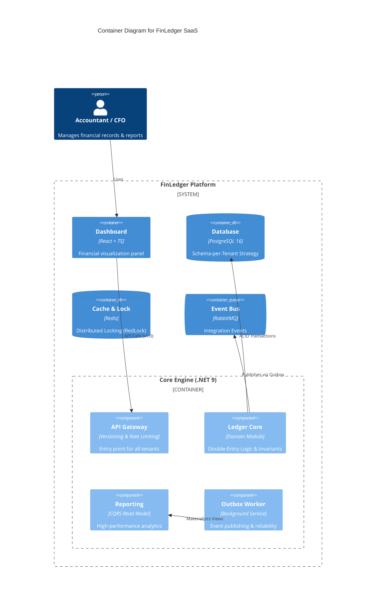

# 🏦 FinLedger SaaS
**Cloud-Native Double-Entry Accounting Engine**

> A high-performance, audit-ready financial ledger system designed for multi-tenant SaaS platforms. Built with **.NET 9**, **PostgreSQL 16**, and **Domain-Driven Design (DDD)**.


## 🎯 Problem Statement
Most modern SaaS applications handle financial data using "Anemic Domain Models", leading to **Data Integrity** issues. In high-stakes FinTech, systems often fail to enforce double-entry invariants or ensure strict tenant isolation. **FinLedger** bridges this gap by combining deep **Accounting Domain expertise** with **Robust Engineering patterns** to provide an immutable, compliant, and highly scalable financial engine.

---

## 🏗️ Architectural Overview (C4 Model)
FinLedger follows a **Modular Monolith** architecture to ensure strict domain boundaries while maintaining deployment simplicity and high consistency.

### System Context & Container Diagram


> **Strategic Note:** We chose a Modular Monolith over Microservices to maintain **Transactional Integrity** and reduce operational complexity while remaining "Microservices-ready". 
> **[Read more about our Strategic Decisions (ARCHITECTURE.md)](./ARCHITECTURE.md)**

---


## 🚀 Core Features & Technical Excellence

### 🏦 Advanced Financial Engine
- **Immutable Ledger (Zero-Delete Policy):** Implements a high-integrity accounting system where journal entries are finalized (Posted) and cannot be modified or deleted. All corrections are handled through **Automated Reversal Logic**, ensuring a 100% reliable audit trail.
- **Double-Entry Integrity:** The domain layer strictly enforces the fundamental accounting equation (`Sum(Debit) == Sum(Credit)`) as a system invariant, preventing out-of-balance transactions at the core level.

### 🏗️ Enterprise Architecture Patterns
- **CQRS with MediatR:** Clear separation of read and write concerns. Write operations use EF Core for complex business logic, while Read operations use **Dapper** for sub-second reporting performance.
- **Outbox Pattern:** Guarantees transactional consistency. Financial events are captured within the same atomic transaction as the business data, ensuring **Exactly-once processing** and preventing data loss during network failures.
- **High-Performance Engineering:** All Command/Query handlers are implemented as **Sealed Classes** to leverage .NET JIT devirtualization optimizations, reducing overhead in high-throughput financial pipelines.

### 🔐 Infrastructure & Resilience
- **Automated Multi-Tenancy:** Uses a sophisticated **Schema-per-Tenant** isolation strategy. The system dynamically creates and migrates database schemas for new tenants on-the-fly, ensuring maximum data privacy and regulatory compliance (GDPR/SOC2).
- **Distributed Locking (RedLock):** Leverages Redis to prevent race conditions during concurrent financial operations, ensuring deterministic states in a horizontally scaled environment.
- **SQL Security & Integrity:** Implements sanitized dynamic SQL execution using **Interpolated Strings** to prevent SQL Injection while maintaining the flexibility of schema-per-tenant isolation.
- **Observability:** 
    - **Structured Logging:** Powered by **Serilog** with JSON formatting for cloud-native log analysis.
    - **Health Monitoring:** Integrated ASP.NET Core Health Checks for PostgreSQL and Redis connectivity.

### 📊 Financial Reporting & Insights
- **Professional PDF Export:** Integrated **QuestPDF** engine to generate audit-ready Trial Balance reports with enterprise-grade layouts and automatic pagination.
- **Demo Data Seeding:** Built-in automated seeding engine to generate complex, balanced financial scenarios for instant testing and demonstration.

### 🛡️ Automated Quality Assurance
FinLedger is guarded by a triple-layer testing suite to ensure financial accuracy and architectural purity:
- **Domain Invariant Protection:** Rigorous testing of the `JournalEntry` aggregate root to prevent unbalanced transactions or illegal state transitions.
- **Architectural Guardrails:** Automated tests that verify modular boundaries, ensuring that the Domain layer remains pure and no prohibited dependencies (e.g., Infrastructure -> Domain) are introduced during development.
- **Integration Testing (TestContainers):** Uses ephemeral **PostgreSQL 16** containers in Docker to verify physical schema isolation and transactional integrity in a real-world environment.
- **Application Logic Verification:** Mocking external concerns with **NSubstitute** to verify command handlers, concurrency locks, and reliable messaging (Outbox).


### 🔐 Identity & Multi-tenant Security 
- **Modular Identity Architecture:** A fully decoupled Identity module designed following Modular Monolith principles, ensuring high cohesion and enabling future microservices extraction.
- **SaaS-Aware JWT Security:** Implements a custom JWT provider that embeds tenant-specific roles and claims into security tokens, allowing for sub-millisecond authorization without redundant database roundtrips.
- **Policy-Based RBAC:** Fine-grained access control using custom `IAuthorizationRequirement` and `AuthorizationHandler`. The system dynamically verifies if a user has the appropriate role (Admin, Accountant, Auditor) within the specific context of the requested Tenant ID.
- **Secure-by-Design Persistence:** Enforces industry-standard **BCrypt** hashing for password security and maintains a dedicated shared schema for global identity to allow seamless cross-tenant authentication.


### 🕵️ Cloud-Native Observability 
- **Distributed Tracing:** Implements full request lifecycle tracking using **OpenTelemetry (OTEL)**. Every request is traced as it travels from the API through MediatR pipelines and down to the database.
- **Performance Diagnostics:** Integrated with **Jaeger** to visualize execution spans, allowing for instant identification of slow SQL queries or distributed lock contentions.
- **Deep Instrumentation:** Automatic monitoring of **PostgreSQL** execution and **Redis** commands, providing a "glass-box" view of system behavior without manual code pollution.

#### 📊 Distributed Tracing in Action (Live Demo)
The following trace demonstrates the full request lifecycle. It captures the correlation between the incoming API call, the MediatR pipeline execution, and the final optimized SQL query execution within the specific tenant's schema.


> **Principal Insight:** This level of observability ensures that we can identify performance bottlenecks at the database layer and verify that our **Schema-per-Tenant** isolation is working correctly in real-time.

**Strategic Technical Signals:**
- **Zero-Guesswork Performance:** Every span provides sub-millisecond precision on execution time across the API, MediatR pipelines, and PostgreSQL layers.
- **Tenant Isolation Proof:** The trace confirms that the SQL instrumentation correctly executes within the dynamically resolved tenant schema (e.g., `berlin_hq`), validating physical data isolation.
- **Maintenance Scalability:** By using **OpenTelemetry**, the system is "Cloud-Agnostic" and ready for enterprise monitoring tools like Prometheus, Elastic, or New Relic without changing a single line of business logic.


### 🛡️ Financial Compliance & Immutable Audit Trails 
- **Zero-Touch Accountability:** Implements an automated auditing engine using EF Core Change Tracking. Every database modification is intercepted and recorded without polluting the business logic handlers, ensuring **100% Audit Coverage**.
- **Correlated Identity Logging:** Seamlessly links every record change to a global User ID extracted from the JWT context, providing a non-repudiable audit trail of "Who, When, and What."
- **High-Fidelity State Capturing:** Utilizes **PostgreSQL JSONB** storage to serialize the exact state of entities at the moment of change, ensuring complete transparency for forensic accounting and regulatory compliance.
- **Schema-Level Sovereignty:** Audit logs are physically persisted within each tenant's isolated schema, ensuring that audit trails remain private and compliant with strict **GDPR and SOC2** data residency requirements.

---

## 🕹️ End-to-End Scenario: The Life of a Transaction

To see the system's robustness, consider this flow:

1. **Request:** A Tenant initiates a transfer via the Versioned API.
2. **Concurrency:** A **Redis Lock** is acquired to ensure serialized access to specific accounts.
3. **Validation:** The **MediatR Pipeline** triggers **FluentValidation** followed by Domain-level invariant checks.
4. **Persistence:** The Ledger record and an **Outbox Message** are saved in a single **ACID Transaction**.
5. **Auditing:** Simultaneously, the system automatically captures the "Before/After" state and the responsible User ID in an **Immutable Audit Log**.
6. **Reliability:** The **Background Worker** ensures the event is published even if the primary API process crashes.
7. **Insight:** The **Reporting Engine** extracts data from the isolated schema to produce a professional PDF report.
8. **Observability:** Every step above is captured as a correlated **Trace** in Jaeger, providing 100% transparency into the transaction's performance.


---


## 🗺️ Project Roadmap

- [x] **Phase 1-4:** Core Engine, Multi-tenant Isolation, Outbox Pattern, Redis Locking, and PDF Reporting.
- [x] **Phase 5: Automated Quality Assurance**
    - [x] Unit Testing (xUnit), Architecture Testing (NetArchTest), and Integration Testing (**TestContainers**).
- [x] **Phase 6: Advanced Identity & RBAC**
    - [x] Multi-tenant JWT, Policy-based Authorization, and **BCrypt** security.
- [x] **Phase 7: Cloud-Native Observability **
    - [x] **OpenTelemetry** integration with **Jaeger** for distributed tracing and performance monitoring.
- [x] **Phase 8: Financial Compliance & Auditing **
    - [x] **Automated Audit Trail:** System-wide tracking of "Who, When, and What" for every database change.
    - [x] **User Attribution:** Seamless integration between JWT Identity and persistence layer via `ICurrentUserProvider`.
    - [x] **Data Integrity:** Physical schema-level auditing to satisfy European financial regulations.
- [x] **Phase 9: Enterprise Deployment & CI/CD **
    - [x] Automated GitHub Actions pipeline for Cloud-based Build & Test
- [x] **Phase 10: Production Hardening & Orchestration **
    - [x] **Docker Multi-stage Build:** Optimized Alpine-based images for high-speed deployment.
    - [x] **Kubernetes Ready:** Fully defined K8s Manifests (Deployments, Services, ConfigMaps).
    - [x] **High Availability:** Pre-configured for horizontal scaling and self-healing.
---

## 🚀 Core Features & Technical Excellence

### 🛡️ Financial Compliance & Immutable Audit Trails 
FinLedger ensures 100% accountability through an automated auditing engine:
- **Zero-Touch Auditing:** Leveraging EF Core Change Tracking to intercept and log every database modification (Insert/Update/Delete) without manual intervention in business handlers.
- **Correlated Identity:** Every audit entry automatically captures the Global User ID from the JWT context via a decoupled `ICurrentUserProvider`.
- **Forensic Transparency:** Entity states are serialized into high-performance **PostgreSQL JSONB** columns, providing a complete "Before/After" history for regulatory compliance.
- **Physical Data Isolation:** Audit logs are stored within each tenant's private schema, satisfying strict **GDPR and SOC2** data residency requirements.

### 🤖 Enterprise CI/CD Pipeline
FinLedger is production-ready with a fully automated delivery pipeline:
- **Continuous Integration:** Every commit is automatically verified via **GitHub Actions** on a Linux environment.
- **Infrastructure-as-Code Testing:** Integration tests utilize **TestContainers** to dynamically spin up PostgreSQL and Redis within the CI runner, ensuring zero environmental drift.
- **Quality Gates:** Enforces strict build and test success criteria before allowing code merges, maintaining the integrity of the Modular Monolith.


## 🚢 Production & Cloud-Native Deployment

FinLedger is designed for the modern cloud, ensuring high availability and operational excellence:

### 🐳 Container Optimization
Uses a **Multi-stage Dockerfile** to minimize the attack surface and image size (~80MB). The runtime environment is based on **.NET 9 Alpine**, following security best practices by running as a **Non-Root user**.

### ☸️ Kubernetes Orchestration
The system is ready for **Enterprise Clusters** (AKS, EKS, GKE) with production-grade manifests:
- **Scalability:** Configured with 3-replica deployments for zero-downtime updates.
- **Resilience:** Implements **Liveness & Readiness Probes** connected to the system's Health Checks.
- **Resource Management:** Explicit CPU/Memory limits and requests to ensure predictable cloud costs and prevent resource contention.
- **Secret Management:** Decoupled sensitive data (JWT keys, Connection Strings) using K8s **Secrets** and **ConfigMaps**.


---

## 🕹️ Getting Started: The Developer Journey

Follow these steps to explore the system's multi-tenant security, financial integrity, and observability.

### 🛠️ 1. Prerequisites & Infrastructure
Ensure you have **Docker Desktop** and **.NET 9 SDK** installed.
```powershell
# Start PostgreSQL, Redis, RabbitMQ, and Jaeger (Monitoring)
docker-compose up -d
```

### 🚀 2. Run the Application
Execute the Host API project in Development mode to enable Swagger and Tracing:
```powershell
$env:ASPNETCORE_ENVIRONMENT="Development"
dotnet run --project src/Modules/Ledger/FinLedger.Modules.Ledger.Api/FinLedger.Modules.Ledger.Api.csproj
```
> **Endpoints:**
> - **Swagger UI:** [http://localhost:5000/swagger](http://localhost:5000/swagger)
> - **Jaeger Tracing:** [http://localhost:16686](http://localhost:16686)

---

### 🛡️ 3. The End-to-End Testing Flow (Step-by-Step)

To verify the full lifecycle of a secure, audited transaction, follow this sequence:

| Step | Action | Endpoint | Key Note |
| :--- | :--- | :--- | :--- |
| **1** | **Register** | `POST /identity/Users/register` | Creates your global identity. |
| **2** | **Assign Role**| `POST /identity/Users/assign-role` | Connects you to a `tenant_id` (e.g., `berlin_hq`) as **Admin (1)**. |
| **3** | **Login** | `POST /identity/Users/login` | Obtain a **JWT Token** containing your tenant-specific roles. |
| **4** | **Authorize** | Click **Authorize** button | Paste the token (Swagger handles the Bearer prefix). |
| **5** | **Execute** | `POST /ledger/Accounts` | Set Header `X-Tenant-Id: berlin_hq`. Schema is auto-provisioned on first call. |
| **6** | **Audit Check**| `GET /ledger/Reports/audit-logs` | Observe how the system automatically tracked your "Who, When, and What". |

---

### 🕵️ 4. Observability in Action
After performing the steps above, visit the **Jaeger Dashboard**. You will see correlated traces showing the MediatR pipeline execution and the exact SQL queries executed inside the tenant's private schema.

---

### 🧪 5. Running the Test Suite
```powershell
# Runs Unit, Architecture, and Integration Tests (TestContainers)
dotnet test
```
- **Integration Tests:** Use ephemeral Docker containers to verify database logic in a clean environment.
- **Architecture Tests:** Enforce Clean Architecture (Onion) boundaries and naming conventions automatically.

---

## 🛠️ Tech Stack

- **Framework:** .NET 9 (C# 13), MediatR, FluentValidation, Serilog.
- **Security:** **JWT Bearer Auth**, **Multi-tenant RBAC**, **BCrypt.Net**.
- **Observability:** **OpenTelemetry (OTEL)**, **Jaeger Dashboard**.
- **Testing:** xUnit, FluentAssertions, NetArchTest, NSubstitute, **TestContainers**.
- **Data:** PostgreSQL 16 (Schema-per-Tenant), EF Core 9, Dapper, Redis (RedLock).
- **Infrastructure:** Docker Compose, QuestPDF, Health Checks.
- **CI/CD & DevOps:** **GitHub Actions**, Docker Compose, **TestContainers**.
- **Orchestration:** **Kubernetes (K8s)**, Docker Compose.
---

---

**Status:** **Production-Grade, High-Availability Ledger Engine Fully Operational.**

> **Note to Reviewers:** This project has successfully passed the full lifecycle from Domain-Driven Design to Kubernetes Orchestration. The current cluster configuration supports self-healing, horizontal scaling, and zero-downtime deployments.


```

---


